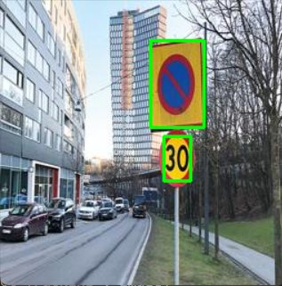

# SignReader

## Project Overview
SignReader is an innovative computer vision project focused on detecting and reading signs, particularly speed limit signs. It leverages Python, OpenCV, and Tesseract OCR to demonstrate robust image processing and optical character recognition capabilities.

## Key Results

*Result with Number Reader (`Result_with_number_reader.jpg`)*

*Result with Sign Finder (`Result_with_sign_finder.jpg`)*

1. **Result with Number Reader:** Demonstrates the system's ability to detect and read numbers from signs, particularly speed limits.
2. **Result with Sign Finder:** Showcases the sign detection feature, highlighting detected signs within images.

These results are featured in the 'Results' folder of this repository.

## Key Features
- **Yellow Object Tracking:** Detects yellow-colored objects in images, a key feature for identifying certain types of road signs.
- **OCR for Speed Limit Recognition:** Applies OCR to extract speed limit information from detected signs.
- **Image Resizing and Renaming:** Manages image datasets efficiently, including resizing and systematic renaming.

## Code Structure
- `Main.py`: The primary script integrating all functionalities of the SignReader project.
- `util.py`: Contains utility functions, such as setting HSV color limits for yellow detection.
- `1_image_resize.py`: Script dedicated to resizing images in the dataset.
- `2_image_rename.py`: Script for systematically renaming images in the dataset.

## Viewing the Results
The result images are embedded at the top of this README. You can also find them in the 'Results' folder within this repository.

## Acknowledgements
This project employs OpenCV for image processing and Tesseract OCR for text recognition. The dataset predominantly features images of 30 km/h signs, with the potential for extension to other sign types.